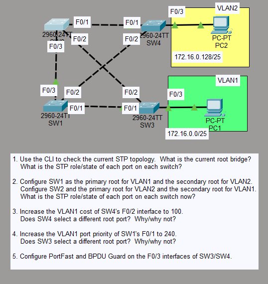
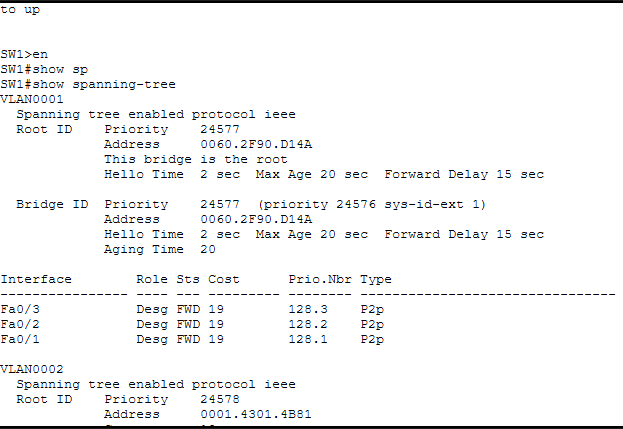
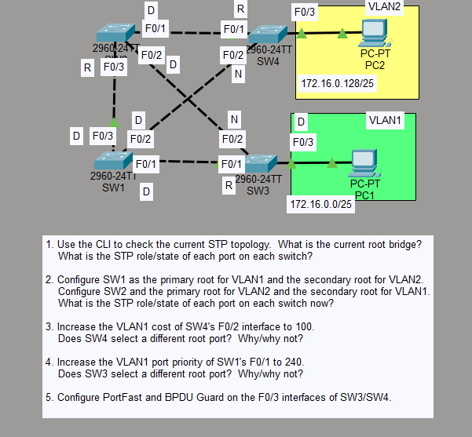
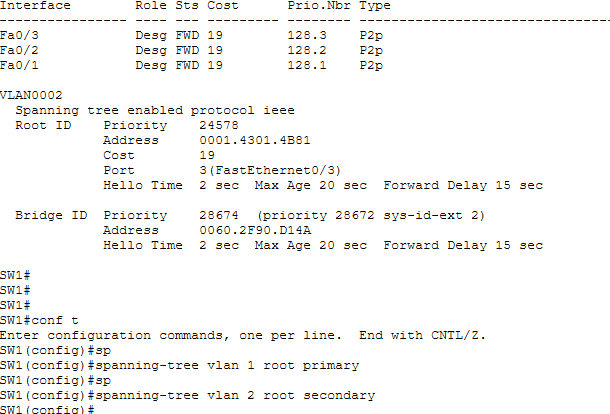
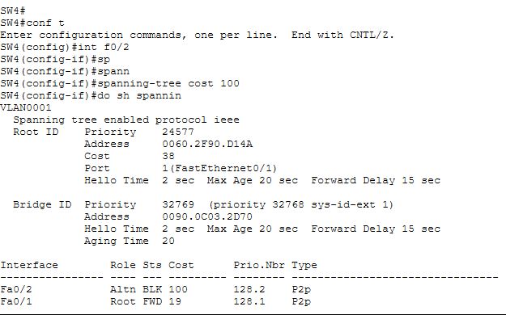
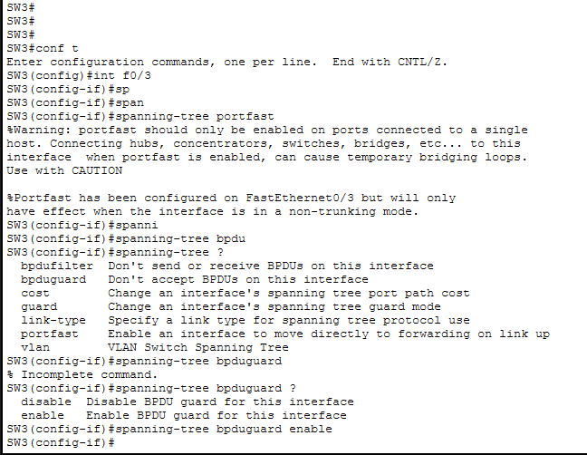
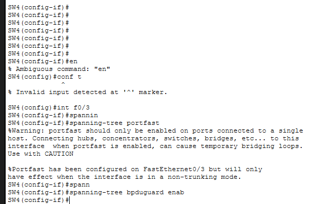

# 🌐 STP Toolkit — Spanning Tree Protocol Configuration Lab

A hands-on networking lab demonstrating **Spanning Tree Protocol (STP)** configuration on Cisco switches using Cisco Packet Tracer. This toolkit covers root bridge election, port roles/states, cost manipulation, PortFast, and BPDU Guard across a multi-switch, dual-VLAN topology.

---

## 📋 Table of Contents

1. [Topology Overview](#topology-overview)
2. [Task 1 — Check Current STP Topology](#task-1--check-current-stp-topology)
3. [Task 2 — Configure Primary & Secondary Root Bridges](#task-2--configure-primary--secondary-root-bridges)
4. [Task 3 — Increase SW4 F0/2 Interface Cost](#task-3--increase-sw4-f02-interface-cost)
5. [Task 4 — Increase SW1 F0/1 Port Priority](#task-4--increase-sw1-f01-port-priority)
6. [Task 5 — Configure PortFast & BPDU Guard](#task-5--configure-portfast--bpdu-guard)
7. [Key STP Concepts](#key-stp-concepts)
8. [Commands Cheat Sheet](#commands-cheat-sheet)

---

## Topology Overview

The lab uses **4 Cisco 2960-24TT switches** (SW1, SW2, SW3, SW4) interconnected in a partial mesh. Two VLANs are in use:

| VLAN | Subnet | Connected Host |
|------|--------|----------------|
| VLAN1 | 172.16.0.0/25 | PC1 on SW3 F0/3 |
| VLAN2 | 172.16.0.128/25 | PC2 on SW4 F0/3 |

**Switch Interconnections:**

| Link | Interface |
|------|-----------|
| SW1 ↔ SW4 | F0/1 — F0/1 |
| SW1 ↔ SW4 | F0/2 — F0/2 |
| SW1 ↔ SW3 | F0/3 — F0/3 |
| SW1 ↔ SW3 | F0/1 — F0/1 |
| SW3 ↔ SW4 | F0/2 — F0/2 |



---

## Task 1 — Check Current STP Topology

### Objective
Use the CLI to determine:
- Which switch is the current **Root Bridge**?
- What is the **STP role and state** of each port on each switch?

### Commands Used
```
SW1> en
SW1# show spanning-tree
```

### Observation

- **VLAN0001** — SW1 is the **Root Bridge** (Root ID and Bridge ID match, priority `24577`, address `0060.2F90.D14A`). All ports on SW1 show role `Desg` (Designated) in `FWD` (Forwarding) state.
- **VLAN0002** — SW1 is **not** the root for VLAN2. Root ID points to address `0001.4301.4B81` (priority `24578`), with SW1's F0/3 acting as the Root Port.



### Port Roles Across All Switches (Initial State)

| Label | Role |
|-------|------|
| R | Root Port |
| D | Designated Port |
| N | Non-Designated (Blocking) |



---

## Task 2 — Configure Primary & Secondary Root Bridges

### Objective
- Make **SW1** the primary root for **VLAN1** and secondary root for **VLAN2**
- Make **SW2** the primary root for **VLAN2** and secondary root for **VLAN1**

### How It Works
`spanning-tree vlan <id> root primary` lowers bridge priority to **24576**, winning the root election. `root secondary` sets priority to **28672** as standby.

### Commands Used
```
! --- SW1 Configuration ---
SW1> en
SW1# conf t
SW1(config)# spanning-tree vlan 1 root primary
SW1(config)# spanning-tree vlan 2 root secondary

! --- SW2 Configuration ---
SW2> en
SW2# conf t
SW2(config)# spanning-tree vlan 2 root primary
SW2(config)# spanning-tree vlan 1 root secondary
```



### Result
- SW1 becomes root for VLAN1 — all ports go **Designated/Forwarding**
- SW2 becomes root for VLAN2 — takes over Designated roles for VLAN2
- Other switches recalculate Root Ports toward the new roots
- Redundant paths go into **Blocking** state to prevent loops

---

## Task 3 — Increase SW4 F0/2 Interface Cost

### Objective
Increase the **VLAN1 STP cost** of SW4's F0/2 interface to `100`.
Does SW4 select a different root port? **Why/Why not?**

### How It Works
STP picks the path with the **lowest cost** to the root. FastEthernet default cost = 19. Raising F0/2 to 100 forces STP to prefer F0/1 instead.

### Commands Used
```
SW4> en
SW4# conf t
SW4(config)# int f0/2
SW4(config-if)# spanning-tree cost 100
SW4(config-if)# do show spanning-tree
```



### Result & Analysis
**Yes**, SW4 selects a different root port.

| Interface | Role | State | Cost |
|-----------|------|-------|------|
| Fa0/2 | Altn | BLK | 100 |
| Fa0/1 | Root | FWD | 19 |

F0/2 is now too expensive — F0/1 becomes the Root Port with cost 19.

---

## Task 4 — Increase SW1 F0/1 Port Priority

### Objective
Increase the **VLAN1 port priority** of SW1's F0/1 to `240`.
Does SW3 select a different root port? **Why/Why not?**

### How It Works
When two paths have **equal cost**, STP uses the upstream port's **priority** as tiebreaker. Lower priority wins. Default = 128. Raising to 240 makes this port less preferred.

### Commands Used
```
SW1> en
SW1# conf t
SW1(config)# int f0/1
SW1(config-if)# spanning-tree vlan 1 port-priority 240
```

### Result & Analysis
**No**, SW3 does not select a different root port. The priority change only affects switches where paths have equal cost AND are directly connected to SW1's F0/1. SW3's existing root port path has a lower cost via another route, so no change occurs.

---

## Task 5 — Configure PortFast & BPDU Guard

### Objective
Configure **PortFast** and **BPDU Guard** on **F0/3 of SW3 and SW4** — the ports connected to end hosts PC1 and PC2.

### How It Works

| Feature | Purpose |
|---------|---------|
| **PortFast** | Skips the 30-second STP convergence on host ports — link comes up instantly |
| **BPDU Guard** | If a BPDU is received on a PortFast port, the port is immediately **err-disabled** to protect the topology |

> ⚠️ **Warning:** Only enable PortFast on ports connected to **end hosts** — never on switch-to-switch links.

### Commands Used
```
! --- SW3 Configuration ---
SW3> en
SW3# conf t
SW3(config)# int f0/3
SW3(config-if)# spanning-tree portfast
SW3(config-if)# spanning-tree bpduguard enable

! --- SW4 Configuration ---
SW4> en
SW4# conf t
SW4(config)# int f0/3
SW4(config-if)# spanning-tree portfast
SW4(config-if)# spanning-tree bpduguard enable
```





### Result
- F0/3 on SW3 and SW4 transitions **immediately to Forwarding** on link-up
- Any BPDU received on these ports will **automatically err-disable** the port

---

## Key STP Concepts

| Concept | Description |
|---------|-------------|
| **Root Bridge** | Switch with the lowest Bridge ID (Priority + MAC). All paths calculated relative to it. |
| **Root Port** | Best (lowest) cost path to the root bridge on a non-root switch. |
| **Designated Port** | Best port on each segment for forwarding traffic toward the root. |
| **Alternate/Blocking Port** | Redundant port placed in Blocking state to prevent loops. |
| **Path Cost** | FastEthernet default = 19. Lower cost = preferred path. |
| **Bridge Priority** | Default 32768. Must be a multiple of 4096. Lower = more likely to be root. |
| **PortFast** | Bypasses STP convergence on edge ports connected to end hosts. |
| **BPDU Guard** | Err-disables a PortFast port if any BPDU is received. |

---

## Commands Cheat Sheet
```
! View STP topology
show spanning-tree
show spanning-tree vlan <id>

! Set root bridge
spanning-tree vlan <id> root primary
spanning-tree vlan <id> root secondary

! Manually set bridge priority (must be multiple of 4096)
spanning-tree vlan <id> priority <value>

! Set interface cost
interface f0/X
spanning-tree cost <value>

! Set port priority on an interface
interface f0/X
spanning-tree vlan <id> port-priority <value>

! Configure PortFast and BPDU Guard on access/host port
interface f0/X
spanning-tree portfast
spanning-tree bpduguard enable
```

---

> 💡 **Lab Environment:** Cisco Packet Tracer | Switches: Cisco 2960-24TT
