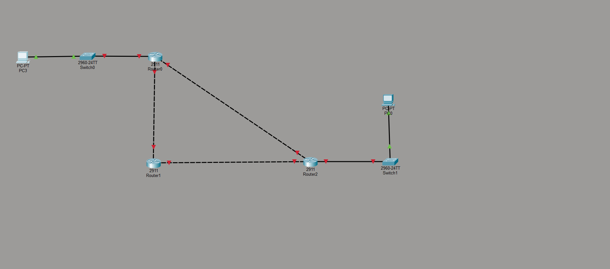
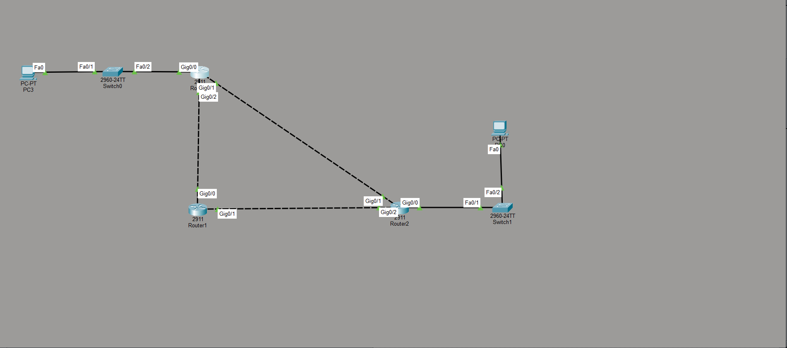
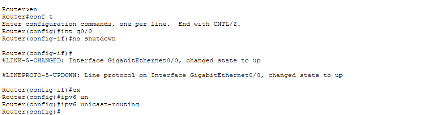
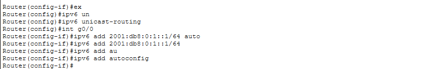
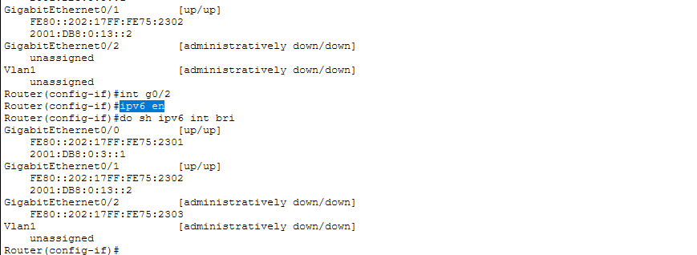
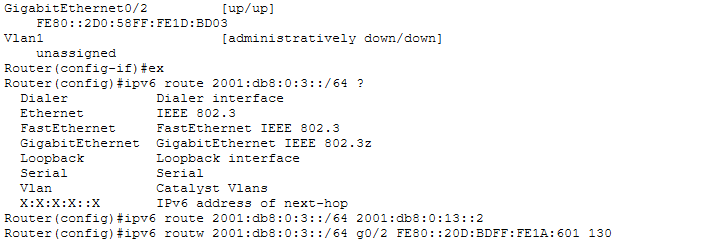
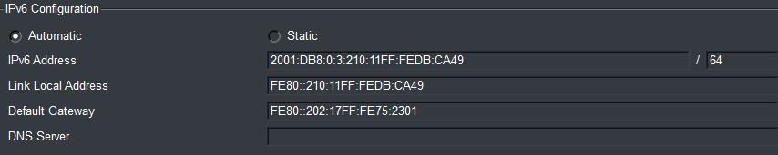
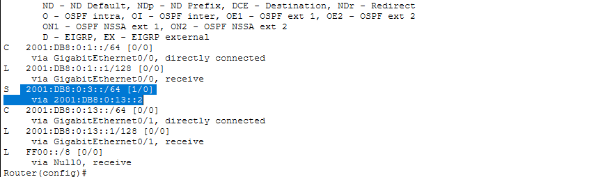
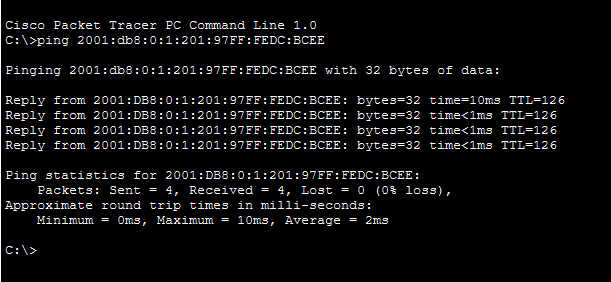

# Lab: IPv6 Static Routes
 
**Course:** Jeremy's IT Lab — CCNA 200-301  
**Topic:** IPv6 Static Routing, SLAAC, and Backup Path Configuration  
**Simulator:** Cisco Packet Tracer
 
---
 
## Objectives
 
- Enable IPv6 unicast routing on Cisco routers
- Assign IPv6 addresses to router interfaces using both manual and SLAAC (autoconfig) methods
- Configure IPv6 static routes between multiple routers
- Set up a floating static route as a backup path
- Verify end-to-end IPv6 connectivity via ping
---
 
## Topology
 
### Before Configuration
 

 
The initial topology shows three routers (Router0 – a 2411, Router1 – a 2911, Router2 – a 2911), two switches (Switch0 and Switch1), and two PCs (PC3 on the left and PC0 on the right). All inter-router links are shown as dashed lines, indicating the interfaces are administratively down or unconfigured. The solid lines represent the PC-to-switch and switch-to-router connections. No IPv6 addresses or routes have been applied yet.
 
### After Configuration
 

 
After configuration, all links display red triangular indicators, which in Packet Tracer represent active IPv6 Neighbor Discovery (ND) activity — confirming that IPv6 is running on the interfaces. The topology now has full logical IPv6 connectivity between all devices. The dashed backup paths between Router0↔Router1 and Router0↔Router2 remain visible, representing the floating static route links.
 
---
 
## Network Addressing
 
| Device | Interface | IPv6 Address |
|--------|-----------|--------------|
| Router0 | Gig0/0 | `2001:DB8:0:1::1/64` |
| Router0 | Gig0/1 | `2001:DB8:0:13::2/64` |
| Router1 | Gig0/0 | `2001:DB8:0:3::1/64` |
| Router1 | Gig0/1 | `2001:DB8:0:13::2/64` |
| Router2 | Gig0/0 | `2001:DB8:0:3::1/64` |
| Router2 | Gig0/1 | Connected to Switch1 |
| PC0 | Fa0 | SLAAC — `2001:DB8:0:3:210:11FF:FEDB:CA49/64` |
 
---
 
## Step-by-Step Configuration
 
### Step 1 — Enable IPv6 Routing
 

 
On each router, IPv6 unicast routing must be explicitly enabled — it is disabled by default on Cisco IOS. The key commands shown are:
 
```
Router> en
Router# conf t
Router(config)# int g0/0
Router(config-if)# no shutdown
Router(config)# ipv6 unicast-routing
```
 
The `no shutdown` command brings up Gig0/0, after which the console confirms the interface state changes to up. The `ipv6 unicast-routing` global command enables the router to forward IPv6 packets between interfaces. Without this command, the router would receive IPv6 traffic on its interfaces but would not route it.
 
---
 
### Step 2 — Configure SLAAC on Router Interfaces
 

 
IPv6 addresses on router interfaces can be assigned manually or via SLAAC (Stateless Address Autoconfiguration). This screenshot shows both approaches being entered:
 
```
Router(config)# int g0/0
Router(config-if)# ipv6 add 2001:db8:0:1::1/64 auto    ← incorrect syntax
Router(config-if)# ipv6 add 2001:db8:0:1::1/64          ← manual assignment
Router(config-if)# ipv6 add autoconfig                  ← SLAAC
```
 
The first attempt with `auto` at the end is an IOS syntax error. The correct approach is either a fully specified address (e.g., `2001:db8:0:1::1/64`) or the `autoconfig` keyword on its own line. `autoconfig` tells the interface to derive its IPv6 address from a Router Advertisement (RA) prefix, using EUI-64 based on the interface MAC address.
 
---
 
### Step 3 — Enable IPv6 on the Backup Path Interface
 

 
This screenshot focuses on Router1's interface configuration. Gig0/1 is brought into the `int g0/2` context and IPv6 is enabled on it with `ipv6 en` (shorthand for `ipv6 enable`). The command `do sh ipv6 int bri` (executed from config mode using `do`) confirms the resulting state:
 
- **Gig0/0** — up/up, address `2001:DB8:0:3::1` + link-local `FE80::202:17FF:FE75:2301`
- **Gig0/1** — up/up, address `2001:DB8:0:13::2` + link-local `FE80::202:17FF:FE75:2302`
- **Gig0/2** — administratively down/down, link-local `FE80::202:17FF:FE75:2303` assigned (IPv6 enabled even though interface is admin-down)
Link-local addresses (`FE80::/10`) are automatically generated on any interface where IPv6 is enabled. They are used for local segment communication and as next-hop addresses in static routes.
 
---
 
### Step 4 — Configure IPv6 Static Routes
 

 
Static routes are configured with the `ipv6 route` command. The screenshot shows the syntax help (`?`) being explored, then the two actual commands entered:
 
```
Router(config)# ipv6 route 2001:db8:0:3::/64 2001:db8:0:13::2
Router(config)# ipv6 route 2001:db8:0:3::/64 g0/2 FE80::20D:BDFF:FE1A:601 130
```
 
**Line 1 — Primary static route:** Packets destined for the `2001:DB8:0:3::/64` network (where PC0 resides) are forwarded to next-hop `2001:DB8:0:13::2` (Router1's Gig0/1).
 
**Line 2 — Floating static route (backup):** The same destination is configured a second time, but via interface `g0/2` with next-hop link-local `FE80::20D:BDFF:FE1A:601` and an **administrative distance of 130**. Since the primary route has a default AD of 1, the backup route will only be installed in the routing table if the primary route fails — hence the term *floating* static route.
 
> **Note:** When using a link-local address as the next hop, you must also specify the exit interface (`g0/2`), because link-local addresses are not globally unique and the router cannot determine which interface to use on its own.
 
---
 
### Step 5 — SLAAC Address Assigned to PC0
 

 
This is the IPv6 configuration panel for PC0. It is set to **Automatic**, meaning it uses SLAAC to obtain an address:
 
| Field | Value |
|-------|-------|
| IPv6 Address | `2001:DB8:0:3:210:11FF:FEDB:CA49/64` |
| Link Local Address | `FE80::210:11FF:FEDB:CA49` |
| Default Gateway | `FE80::202:17FF:FE75:2301` |
 
The global IPv6 address is derived from the `/64` prefix advertised by Router2 (`2001:DB8:0:3::/64`) combined with an EUI-64 host identifier generated from PC0's MAC address. The default gateway is Router2's link-local address on the connected interface.
 
---
 
### Step 6 — Verify Routing Table
 

 
The `show ipv6 route` output on Router0 confirms the routing table is correctly populated:
 
```
C    2001:DB8:0:1::/64 [0/0]     ← directly connected (Gig0/0)
L    2001:DB8:0:1::1/128 [0/0]   ← local host route
S    2001:DB8:0:3::/64 [1/0]     ← static route (highlighted)
      via 2001:DB8:0:13::2
C    2001:DB8:0:13::/64 [0/0]    ← directly connected (Gig0/1)
L    2001:DB8:0:13::1/128 [0/0]  ← local host route
L    FF00::/8 [0/0]              ← multicast (Null0)
```
 
The highlighted entry `S 2001:DB8:0:3::/64 [1/0]` is the active primary static route with AD=1. The floating backup route (AD=130) does **not** appear here because the primary is currently active — it will only enter the table if the primary path goes down.
 
**Route code legend:** `C` = Connected, `L` = Local, `S` = Static
 
---
 
### Step 7 — Verify End-to-End Connectivity
 

 
A ping is issued from PC3 (left side) to PC0's SLAAC-assigned address `2001:DB8:0:1:201:97FF:FEDC:BCEE`:
 
```
C:\>ping 2001:db8:0:1:201:97FF:FEDC:BCEE
 
Reply from 2001:DB8:0:1:201:97FF:FEDC:BCEE: bytes=32 time=10ms TTL=126
Reply from 2001:DB8:0:1:201:97FF:FEDC:BCEE: bytes=32 time<1ms TTL=126
Reply from 2001:DB8:0:1:201:97FF:FEDC:BCEE: bytes=32 time<1ms TTL=126
Reply from 2001:DB8:0:1:201:97FF:FEDC:BCEE: bytes=32 time<1ms TTL=126
 
Packets: Sent = 4, Received = 4, Lost = 0 (0% loss)
```
 
All 4 packets are received with 0% loss. The TTL value of **126** (started at 128, decremented by 2 hops — Router0 and Router2) confirms the traffic is traversing exactly 2 routers as expected. The first reply shows 10ms due to ARP/ND resolution; subsequent replies drop to sub-millisecond.
 
---
 
## Key Concepts
 
**IPv6 Unicast Routing** — Must be explicitly enabled with `ipv6 unicast-routing`. Without it, the router acts as an IPv6 host, not a router.
 
**SLAAC (Stateless Address Autoconfiguration)** — Hosts generate their own IPv6 address using the /64 prefix from a Router Advertisement + an EUI-64 interface identifier derived from their MAC address. No DHCPv6 server required.
 
**Link-Local Addresses** — Automatically assigned to every IPv6-enabled interface (prefix `FE80::/10`). Used for next-hop in static routes when pointing to a specific interface.
 
**Floating Static Routes** — A backup static route configured with a higher administrative distance than the primary. It sits dormant in the config but only enters the routing table when the primary route is removed (e.g., interface failure).
 
**Administrative Distance** — A trustworthiness value for routes. Lower = more preferred. Static routes default to AD=1; the backup here uses AD=130 so it never competes with the primary.
 
---
 
## Commands Reference
 
```bash
# Enable IPv6 routing globally
ipv6 unicast-routing
 
# Assign a static IPv6 address to an interface
ipv6 address 2001:db8:0:1::1/64
 
# Enable IPv6 on interface (generates link-local only)
ipv6 enable
 
# Use SLAAC on an interface
ipv6 address autoconfig
 
# Configure a static IPv6 route (global next-hop)
ipv6 route 2001:db8:0:3::/64 2001:db8:0:13::2
 
# Configure a floating static route via link-local next-hop
ipv6 route 2001:db8:0:3::/64 g0/2 FE80::20D:BDFF:FE1A:601 130
 
# Verify IPv6 interfaces (brief)
show ipv6 interface brief
 
# Verify IPv6 routing table
show ipv6 route
```
 
